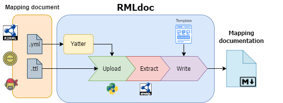

# RML Documentation (RMLdoc) Specification Document-Draft
**Version:** 0.1.0
**Date:** 2024-03-05

## Table of Contents

1. [Introduction](#1-introduction)
   - [Purpose](#purpose)
   - [Scope](#scope)
2. [Workflow](#workflow)
5. [Design Specifications](#design-specifications)
   
   - [Metadata](#metadata)
   - [Version](#version)

4. [Documentation References](#documentation-references)

## 1. Introduction

Mapping documentation, in the context of data integration and data management, refers to a set of documents and information that describe how data from one source or system is related or "mapped" to data in another source. The primary purpose of mapping documentation is to provide a clear understanding of how data is transformed, converted, or linked between different data formats.

**Objectives:**

The primary objectives of mapping documentation are as follows:

1. **Data Integration:** The primary objective is to generate clear documentation defining how data from one source relates to data in another. This ensures that data can be combined and used cohesively across different sources.
2. **Data Transformation:** Mapping documentation specifies how data values are transformed, converted, or translated between sources. 
3. **Data Quality:** By documenting mapping rules and validation criteria, mapping documentation helps maintain data quality by ensuring that data is validated and cleaned during the integration process.
4. **Interoperability:** Mapping documentation promotes interoperability between systems and data sources. It allows different knowledge graph engineers, researchers and stakeholders to understand and work with data in a consistent and standardized manner.
5. **Traceability:** Mapping documentation provides traceability, allowing users to trace data back to its source. This is important for troubleshooting, and data lineage analysis.
7. **Project Collaboration:** Mapping documentation serves as a communication tool among various stakeholders involved in a data integration project, including data analysts, data engineers, and business users. It helps ensure everyone is on the same page regarding data transformations and mappings.
8. **Change Management:** As data sources or requirements change over time, mapping documentation can be updated to reflect these changes, making it easier to manage and adapt to evolving data needs.

In summary, mapping documentation plays a critical role in ensuring data consistency, quality, and interoperability across different systems and data sources. It facilitates the effective use of data in various business processes and analytical activities.

### 1.1 Purpose and scope

**RML documentation (RMLdoc)** is a tool designed to simplify the process of generating documentation of mappings used for knowledge graph construction. It automates the documentation generation process, allowing users to easily understand the mapping transformation rules defined within their projects. Given an input mapping file written in R2RML, RML, or YARRRML, RMLdoc will generate a detailed Markdown documentation explaining each mapping with corresponding diagrams, in a human readable manner.


## 2. Workflow
[Include diagrams]
(COGER EL DIAGRAMA DEL PAPER Y EXPLICAR POR ENCIMA)
(PARA EL DIAGRAMA, FORMATO DE MAPPINGS DE ENTRADA Y VER SI SE PUEDE MEJORAR ALGO MAS)





## 3. Design Specifications

Specifications for **RML documentation(RMLdoc)** detail how the RML mapping needs to be structured in order to show that information in the documentation. Here are some design specifications for RML Mapping.

### 3.1 Metadata: 

**RML Documentation (RMLdoc)** accepts the following metadata within the RML mapping to generate the documentation. It will display the version, author, and license by default to promote the use of these metadata within the mappings.

| Metadata |  |  |
| -------------- | -------------- | -------------- |
| **schema:Dataset**\| **void:Dataset**\| **dcat:Dataset** | [schema:Dataset](https://schema.org/Dataset) | A collection of data |
| **schema:version**\| **dcat:version** | [schema:version](https://schema.org/version) | The version of the mapping. |
| **schema:author** | [schema:author](https://schema.org/author) | The author of this content. |
| **schema:contributor**\| **dc:contributor** | [schema:contributor](https://schema.org/contributor) | contributor to the mapping. |
| **schema:description**\| **dc:description** | [schema:description](https://schema.org/description) | A description of the item |
| **schema:license**\| **dc:license** | [schema:license](https://schema.org/license) | A license document that applies to this content, typically indicated by URL. |
| **schema:title**\| **dc:title** | [schema:title](https://schema.org/title) | The title of the mapping document |
| **schema:dateCreated**\| **dc:created** | [schema:dateCreated](https://schema.org/dateCreated) | The date on which the mapping was created |


---

Example:

```turtle
@prefix dct: <http://purl.org/dc/terms/> .
@prefix foaf: <http://xmlns.com/foaf/0.1/> .
@prefix schema: <http://schema.org/> .

map:person_000 dct:contributor foaf:Person ;
	rdfs:label "Jhon Toledo" ;
	foaf:mbox <mailto:ja.toledo@upm.es> .

map:person_001 dct:contributor foaf:Person ;
	rdfs:label "Ana Iglesias-Molina" .

map:rules_000 schema:contributor map:person_000, map:person_001 ;
	<http://rdfs.org/ns/void#exampleResource> map:map_stoptimes_000 ;
	rdf:type schema:Dataset;
    schema:version "0.1.0";
    schema:title "GTFS-Madrid-Bench CSV mapping excerpt";
    schema:dateCreated "03-05-2024";
    schema:description "RML mapping with a subset of the GTFS-Madrid-Bench mapping for CSV files.".
```

---


### 3.2 Source

(QUÉ SE ESTÁ COGIENDO A NIVEL CONCPTUAL, REDIRECCIONAR A SPEC DE RML)

---


```turtle
map:person_000 dct:contributor foaf:Person ;
	rdfs:label "Jhon Toledo" ;
	foaf:mbox <mailto:ja.toledo@upm.es> .

map:person_001 dct:contributor foaf:Person ;
	rdfs:label "Ana Iglesias-Molina" .

map:rules_000 schema:contributor map:person_000, map:person_001 ;
	<http://rdfs.org/ns/void#exampleResource> map:map_stoptimes_000 ;
	rdf:type schema:Dataset;
    schema:version "0.1.0";
    schema:title "GTFS-Madrid-Bench CSV mapping excerpt";
    schema:dateCreated "03-05-2024";
    schema:description "RML mapping with a subset of the GTFS-Madrid-Bench mapping for CSV files.".

<myTriplesMap> a rr:TriplesMap;

	rml:logicalSource [
		a rml:LogicalSource;
		rml:source "/data/FREQUENCIES.csv";
		rml:referenceFormulation ql:CSV
	];
	rr:subjectMap [
		a rr:SubjectMap;
		rr:template "http://transport.linkeddata.es/madrid/metro/frequency/{trip_id}-{start_time}";
	];
	rr:predicateObjectMap [
		rr:predicateMap [
			a rr:PredicateMap;
			rr:constant rdf:type;
		];
		rr:objectMap [
			a rr:ObjectMap;
			rr:constant gtfs:Frequency;
		];
	];
```


---

## 4. Documentation References
* https://rml.io/specs/rml/
* https://rml.io/yarrrml/spec/

----------------------------

Copyright © 2024 *[RMLdoc](https://github.com/oeg-upm/rmldoc)*
